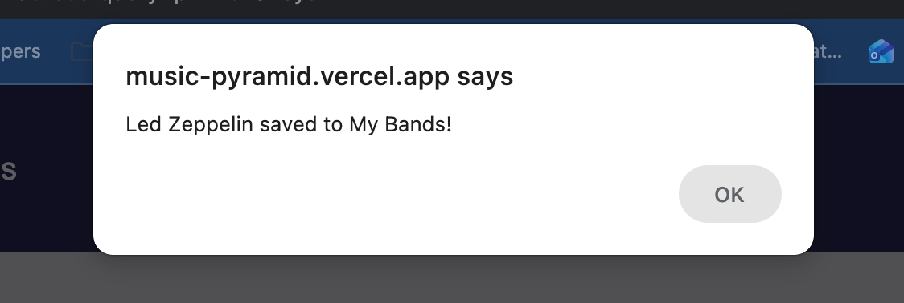

# Music Pyramid - Search and save a personal list of similar bands.

## About Music Pyramid
Music Pyramid was born out of a simple frustration shared by many music fans: finding new bands that truly resonate with the sound of the artist you already love. In a household full of music lovers, discovering similar music and keeping track of it in one easy place, proved to be more difficult than expected. After researching existing solutions, it became clear that while many applications allow you to search for and save music, few focus on helping listeners find and explore similar bands in an engaging way. This inspired the creation of Music Pyramid, an application dedicated to helping you, find, listen to, and log new music based on the bands you already enjoy. 
 
Below is a preview of the home page.


On the home page, once you create an account, you are able to select the "SEARCH BANDS" button and start finding your next favorite band! Enter a favorite band and a list of similar bands is revealed.

Preview of the similarBands page.


For each band result, you have the option to explore the band. If you click the save button a box will appear confirming you want to save.  


Once you save the band to the "myBands" page, a wikipedia link and youTube link are provided to learn more about the band and preview a song. 


On the Similar Bands Page you can search for similar bands you already enjoy listening to. Enter a band name and a list of similar bands will appear for you to explore. 

## Every band you save is stored in your account so you can revisit them anytime in the My Bands page.

At anytime you can delete a bank from your "My Bands" page.


## About This Application

This is a [Next.js](https://nextjs.org/) project bootstrapped with [`create-next-app`](https://github.com/vercel/next.js/tree/canary/packages/create-next-app).

## Getting Started

First, run the development server:

```bash
npm run dev
# or
yarn dev
```

Open [http://localhost:3000](http://localhost:3000) with your browser to see the result.

You can start editing the page by modifying `pages/index.js`. The page auto-updates as you edit the file.

[API routes](https://nextjs.org/docs/api-routes/introduction) can be accessed on [http://localhost:3000/api/hello](http://localhost:3000/api/hello). This endpoint can be edited in `pages/api/hello.js`.

The `pages/api` directory is mapped to `/api/*`. Files in this directory are treated as [API routes](https://nextjs.org/docs/api-routes/introduction) instead of React pages.

## Learn More

To learn more about Next.js, take a look at the following resources:

- [Next.js Documentation](https://nextjs.org/docs) - learn about Next.js features and API.
- [Learn Next.js](https://nextjs.org/learn) - an interactive Next.js tutorial.

You can check out [the Next.js GitHub repository](https://github.com/vercel/next.js/) - your feedback and contributions are welcome!

## Deploy on Vercel

The easiest way to deploy your Next.js app is to use the [Vercel Platform](https://vercel.com/new?utm_medium=default-template&filter=next.js&utm_source=create-next-app&utm_campaign=create-next-app-readme) from the creators of Next.js.

Check out our [Next.js deployment documentation](https://nextjs.org/docs/deployment) for more details.
